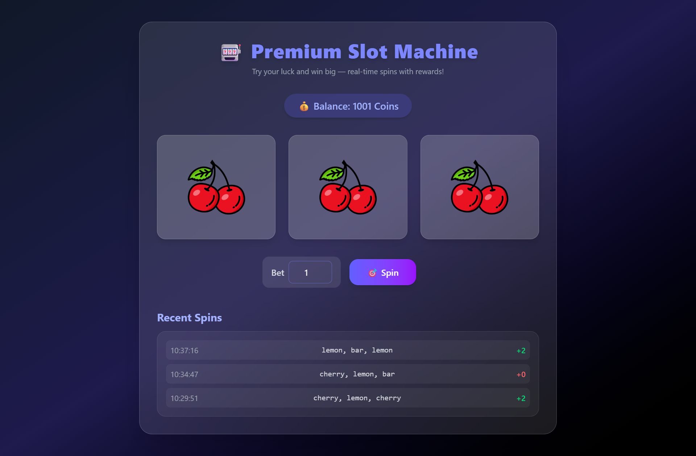

# 🎰 Premium Slot Machine Game (Ruby on Rails + Tailwind CSS)

A fully functional **slot machine web game** built with **Ruby on Rails 7**, **StimulusJS**, and **Tailwind CSS** — designed for **real-world use** (gaming, entertainment, or reward-based systems).

Players can spin, place bets, view recent spins, and earn rewards — all with a **beautiful glassmorphism UI** and **real-time updates**.

---

## UI 

---
## 🎥 Demo Video

<video width="640" height="360" controls>
  <source src="./app/assets/images/demo/20251026-1043-23.1031158.mp4" type="video/mp4">
  Your browser does not support the video tag.
</video>
---
## 🚀 Features

- 🎮 Interactive 3-reel slot machine  
- 💰 Balance tracking and betting system  
- 🪄 Real-time spin animation using StimulusJS  
- 🧠 Smart win/loss calculation logic  
- 🧾 Spin history (last 5 spins)  
- 🌈 Premium Tailwind UI — responsive, modern, and glassy  
- 🔒 Session-based data tracking  
- ⚙️ Ready for integration with authentication or rewards  

---

## 🧩 Tech Stack

| Layer | Technology |
|-------|-------------|
| Backend | Ruby on Rails 7 |
| Frontend | Tailwind CSS + StimulusJS |
| Database | PostgreSQL / SQLite |
| Assets | Importmap / ESBuild (depending on setup) |
| UI Theme | Glassmorphism + Gradient (Indigo/Purple) |

---

## 🖼️ UI Preview

> 🎨 The UI features a premium gradient background, glowing neon buttons, and responsive reel animations.

```

🎰 Premium Slot Machine
💰 Balance: 120 Coins
[ 🍒 | 🍋 | 🍇 ]
Bet: [ 10 ]  🎯 Spin

````

---

## 📦 Installation

Clone this repository and install dependencies:

```bash
git clone https://github.com/shiboshreeroy/slot-machine-rails.git
cd slot-machine-rails
bundle install
rails db:create db:migrate
````

Install Tailwind CSS (if not already):

```bash
rails tailwindcss:install
```

Run the server:

```bash
rails s
```

Then open in your browser:

```
http://localhost:3000
```

---

## 🧠 Project Structure

```
app/
 ├── controllers/
 │   └── game_sessions_controller.rb
 ├── models/
 │   ├── game_session.rb
 │   └── spin.rb
 ├── views/
 │   └── game_sessions/
 │       └── show.html.erb
 ├── javascript/controllers/
 │   └── slot_controller.js
 └── assets/images/reels/
     ├── cherry.png
     ├── lemon.png
     ├── grape.png
     └── bar.png
```

---

## 🎨 Design System

* **Background:** Gradient `from-gray-900 via-indigo-950 to-black`
* **Accent Colors:** Indigo → Purple
* **Glass Effect:** `bg-white/10` + `backdrop-blur-xl`
* **Font:** Sans-serif, bold display for titles
* **Animations:** Tailwind transitions + custom spin keyframes

---

## 🧱 Example Stimulus Controller (slot_controller.js)

Handles spinning, updating reels, and showing results:

```javascript
import { Controller } from "@hotwired/stimulus"

export default class extends Controller {
  static targets = ["reel", "bet", "message", "history"]
  static values = { url: String }

  spin() {
    const bet = this.betTarget.value

    fetch(this.urlValue, {
      method: "POST",
      headers: { "X-CSRF-Token": document.querySelector('meta[name="csrf-token"]').content },
      body: new URLSearchParams({ bet })
    })
    .then(res => res.json())
    .then(data => {
      this.updateReels(data.reels)
      this.updateBalance(data.balance)
      this.showMessage(data.message)
      this.updateHistory(data.history)
    })
  }

  updateReels(reels) {
    this.reelTargets.forEach((reel, i) => {
      reel.classList.add("spin")
      setTimeout(() => {
        reel.querySelector("img").src = `/assets/reels/${reels[i]}.png`
        reel.classList.remove("spin")
      }, 500)
    })
  }

  updateBalance(balance) {
    document.querySelector("[data-balance-target='value'] span").textContent = balance
  }

  showMessage(msg) {
    this.messageTarget.textContent = msg
  }

  updateHistory(historyHTML) {
    this.historyTarget.innerHTML = historyHTML
  }
}
```

---

## ⚙️ Future Enhancements

* 🔗 Integrate user authentication (Devise)
* 🪙 Connect with reward system (points or coins)
* 🎵 Add background music & sound effects
* 📱 Progressive Web App (PWA) version
* 🌍 Leaderboards and multiplayer

---

## 🧾 License

**MIT License** — free for personal and commercial use.
Created with ❤️ by **Nihal**.

---

## 💡 Credits

* 🎨 UI Design: Tailwind CSS
* ⚡ Framework: Ruby on Rails
* 💎 Developer: Nihal
* 🪙 Icons & Assets: Custom reel images (cherry, lemon, grape, bar)

---

> *A fun way to learn Ruby on Rails — build, spin, and win! 🎰*
